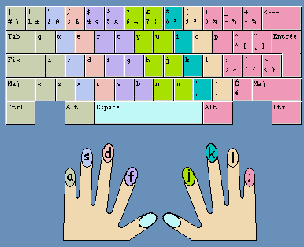

# Simple vim

The main config, I remaped `hjkl` with `jkl;`.
That make more sense for me, your indexs have to be on the `F` and the `J`.



## Tree

```
├── .config/vim
│   ├── init.vim
│   ├── personnal-info.vimrc
│   ├── plug-config.vimrc
│   ├── plug.vimrc
│   └── settings.vimrc
└── .vimrc
```

# Plug

* [auto-pairs][1]
* [nerdtree][2]
* [42 header][3]

[1]: https://github.com/jiangmiao/auto-pairs
[2]: https://github.com/preservim/nerdtree
[3]: https://github.com/42Paris/42header
